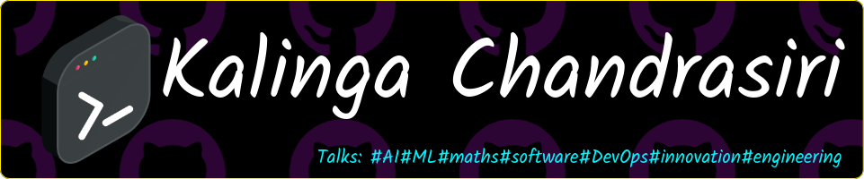

<!-- 

https://leviarista.github.io/github-profile-header-generator/
-->

  

  

 </a> 

<h1 align="center"> Hey, I am Kalinga </h1>
<h3 align="center">Electronic & Telecom. Engineering UG | DevOps Intern | Tech Enthusiast</h3>

- 🔭 I’m currently working on **my university projects.**

- 🌱 I’m currently learning **Electronics and Telecommunication Engineering.**

- 👯 I am seeking to engage in **Research-oriented endeavors.**

- 💬 Ask me about **Computer Vision, Machine Learning, Digital Signal Processing, ...**

- 🎳 Visit my [blog](https://kalingachandrasiri.blogspot.com/) to read about the **projects I have done.**

- 📫 How to reach me **kavindukalingayu@gmail.com**

- ⚡ Fun fact: **I love to play Computer Games and Watch Movies.**

<h3 align="left">Connect with me:</h3>

<!--  -->

<h3>Languages and Tools:</h3>

         <a href="https://www.w3schools.com/cpp/" target="_blank" rel="noreferrer">                   

<!--                         --> 
  

## Just a Python 🐍 Eating away my Contributions...😭

 

&nbsp;

